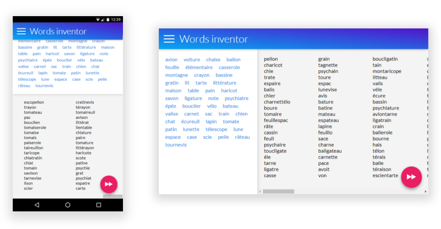

# Words inventor
Ce projet sert à alimenter l'inspiration pour trouver des noms. Que ce soit pour une application, un projet, ou même pourquoi pas un animal de compagnie.

**Accès à l'application:** https://inventor.y-tournebise.com/

## Screenshot

## Utilisation
### Génération de mots
La page est découpée en **deux parties**. **La partie gauche** (haut sur mobile) permet à l'utilisateur de **rentrer des mots**. C'est mots sont **analysés en temps réel pour générer de nouveaux mots sur le panneau de droite** (bas sur mobile).

Les mots entrés par l'utilisateur peuvent être sous forme de **liste séparée par des espaces, des retours à la ligne, ou tout caratère de type virgule, point, etc.**

L'utilisateur peut aussi simplement **coller un texte entier directement**. L'analyseur ne prendra en compte chaque mot en doublon qu'une seule fois.

**Le bouton flottant** en bas à droite sert à **lancer la génération de mots supplémentaire**. En effet, certains échantillons de mots entrées par l'utilisateur peuvent être source d'un très grand nombre de nouveaux mots. La génération est donc limitée à un nombre maximum de tentative. Le bouton permet d'en lancer de nouvelles.

### Persistance de l'échantillon
Le navigateur enregistre automatiquement (à chaque frappe du clavier) la liste des mots entrée par l'utilisateur. Rien est envoyé au serveur, tout est stocké dans le [local storage](https://developer.mozilla.org/fr/docs/Web/API/Window/localStorage)

Ainsi, à la réouverture de l'application, la liste sera rechargée automatiquement.

## Fonctionnement
Pour générer de nouveaux mots, **une analyse est préalablement faite** à partir d'autres mots. Cette analyse consiste à générer des **statistiques de succession des lettres entre elles**.

Par exemple, prenons le mot **inventer**. La lettre "n" peut être précédée que par un "i" ou un "e" dans les mêmes proportions. En revanche, le "v" ne peut être précédée que par un "n".

Pour éviter qu'une lettre se suive plus de deux fois dans un même mots, l'analyse se fait sur deux lettres consécutives. Pour reprendre l'exemple précédent, la lettre "n" ne peut être précédée que par "ve" ou "^i" ("^" représente le début du mot).

## Installation
Il suffit de servir le répertoire  `public` avec un apache ou autre et ça fonctionne !

Toute la logique est côté client.

Il n'y pour le moment besoin d'aucune base de données.

### Sans serveur
Vous pouvez aussi ouvrir directement le fichier `index.html` dans le navigateur. Le serveur n'est utile que pour rappatrier l'exemple. Et plus tard, il servira à mémoriser des listes.
